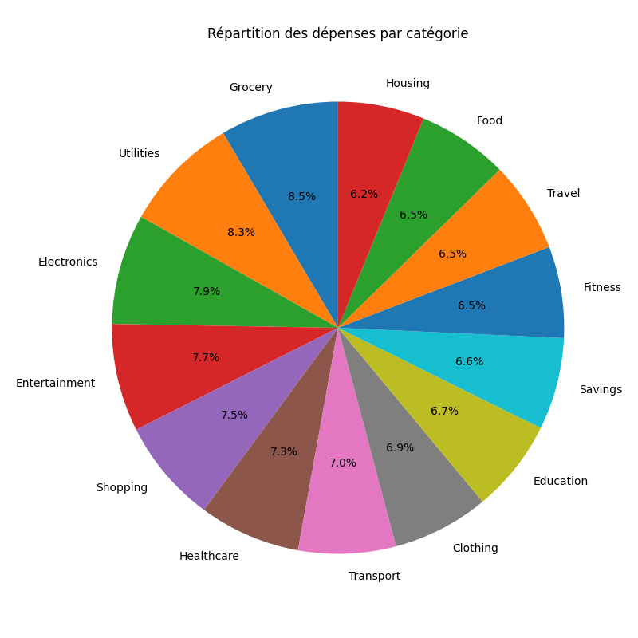

# BudgetScore

💰 **BudgetScore** est un outil d'analyse intelligente des relevés bancaires personnels.


[](https://github.com/SamuelPouyade/budgetScore)

---

## 🔍 Fonctionnalités

- 📥 Lecture de fichiers CSV de transactions bancaires
- 💸 Analyse des dépenses par catégorie
- 💰 Calcul du total des revenus
- 📆 Bilan mensuel (revenus - dépenses)
- 📊 Visualisation avec graphiques (camembert, barres)

---

## 📁 Structure du projet

```
BudgetScore/
├── data/                         # Fichiers CSV de transactions
├── scripts/
│   ├── parser.py                # Chargement et nettoyage des données
│   ├── analyse.py               # Analyse des flux financiers
│   └── visualisation.py         # Graphiques et visualisation
├── notebooks/                   # Explorations Jupyter (facultatif)
├── README.md
└── requirements.txt
```

---

## ▶️ Lancer une analyse

1. Activer l’environnement virtuel :
```bash
source venv/bin/activate
```

2. Lancer les analyses :
```bash
python3 scripts/analyse.py
```

3. Lancer les visualisations :
```bash
python3 scripts/visualisation.py
```

---

## 📸 Exemple d'analyse visuelle




---

## 🔜 Prochaines fonctionnalités

- Score budgétaire automatique
- Export PDF des bilans
- Interface web avec Streamlit

---

Développé par [Samuel Pouyade](https://github.com/SamuelPouyade) — 2025 🧠
